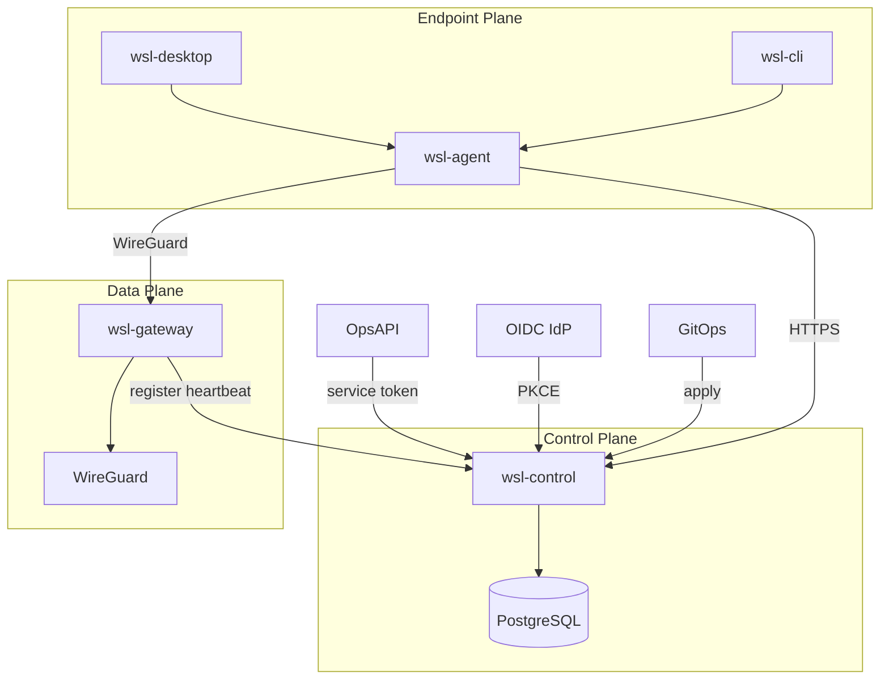

# Architecture

WSL Zero Trust VPN is a self-hosted WireGuard Zero Trust access platform.

## Planes

## Components

| Component | Role |
|-----------|------|
| `wsl-control` | Identity, devices, policy, sessions, SCIM, OpsAPI provisioning, audit |
| `wsl-gateway` | WireGuard peers, routes, firewall, heartbeat |
| `wsl-agent` | Endpoint auth, device keys, posture, tunnel lifecycle |
| `wsl-cli` | Operator/user CLI over agent IPC |
| `wsl-desktop` | Thin macOS UI over agent |

## Security boundaries

- Control plane is authoritative for access decisions (fail-closed).
- Gateways apply only versioned peer configs from the control plane.
- Private keys never leave secure storage (Keychain / 0600 file fallback for dev).
- Sessions are short-lived; expiry or revoke removes peers.

## Product namespace

Display name: **WSL Zero Trust VPN**. Internal crate prefix: `wsl_*`. Config key `product.namespace` (default `wsl`) allows rebrand without architecture changes.
