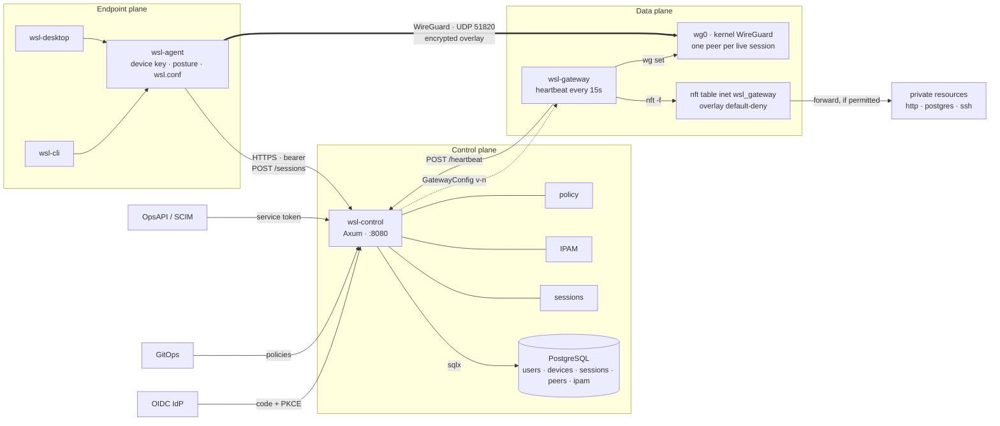
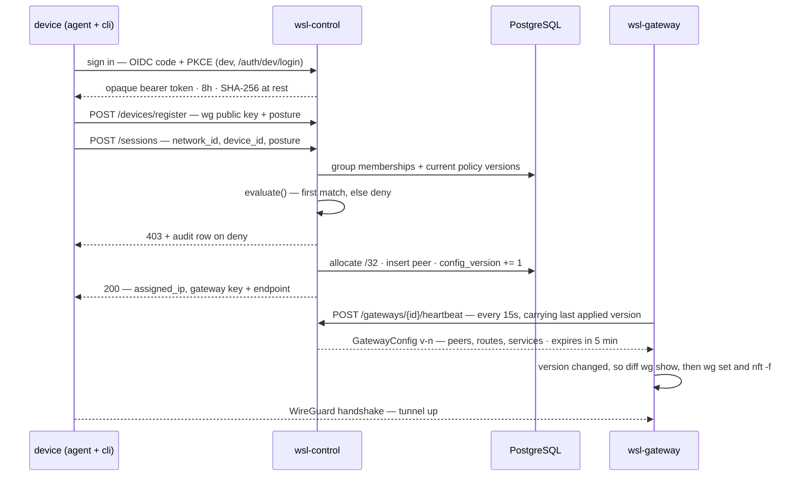
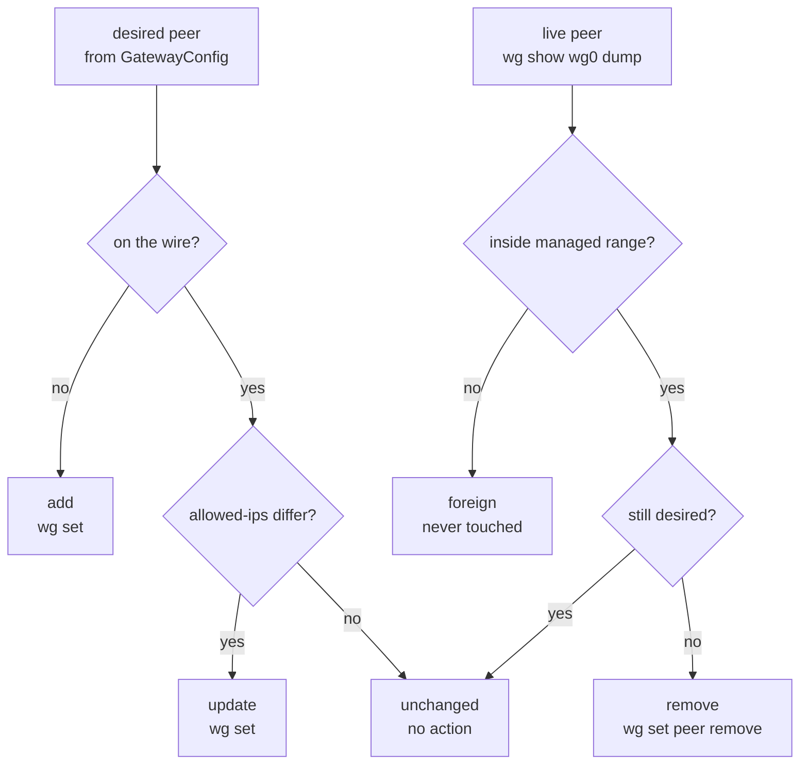
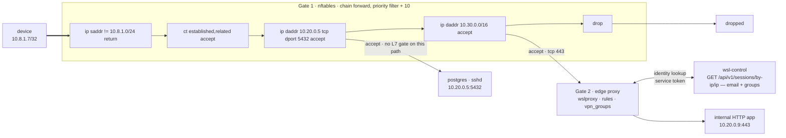

# How it works

A walkthrough of the path from `wsl login` to an enforced tunnel. [Architecture](ARCHITECTURE.md)
lists the components; this document shows what they do to each other.

## Three planes, and one path that skips the middle

Everything in the repo falls into one of three planes. The endpoint plane authenticates and asks
for access. The control plane is the only thing that decides. The data plane carries packets and
holds no opinions it was not handed.

The edge that matters most is the last one: user traffic goes straight from the device to the
gateway over WireGuard. The control plane sits on the *authorization* path, never on the *data*
path — so a control-plane outage stops new sessions rather than existing ones.

The agent and the gateway are both HTTPS clients of the control plane; neither talks to the other
over anything but WireGuard. The gateway pulls — it is never pushed to.

## What happens when you run `wsl connect`

A session is created in one request, and everything that request touches is a row in Postgres. The
gateway learns about it a moment later, on its next heartbeat, because the write bumped a version
number.

Policy evaluation is **fail-closed**. Policies are scanned in order, the first one whose subjects
(group or email) and resources (network name or `*`) match wins, and if nothing matches the answer
is deny. A denial is written to the audit log with the policy id, version and originating git commit
before the request returns 403.

**The address is the identity.** IPAM walks the network CIDR, skips `.0`, `.255` and the gateway's
`.1`, and hands out the first free `/32`. That address is recorded against the session — which is
what later lets an edge proxy turn a source IP back into a user.

## Reconciling the wire, without touching what is not ours

Every config version is applied as a diff against live interface state read from `wg show wg0 dump`,
not written blind. Adding peers is the easy half. Removing them is what makes revocation real:
without removal, an expired session's peer stays on the wire indefinitely.

Removal is also the dangerous half, because a gateway can be pointed at a hub that already exists
and already carries peers. So one rule gates every destructive action: a live peer is eligible for
removal only when **all** of its allowed-ips fall inside the managed range.

A peer straddling the boundary, an unparseable allowed-ip, a `0.0.0.0/0` exit peer, an IPv6 peer
under an IPv4 range — all classified foreign, and foreign is never touched. When the managed range
cannot be resolved at all, removal is disabled for the whole cycle with a warning: the gateway never
deletes what it cannot classify.

The managed range defaults to the network CIDR the control plane serves. When adopting an existing
hub you carve a disjoint range — hub peers in `10.8.0.0/24`, sessions in `10.8.1.0/24` — which turns
the safety check into a plain subnet test. See [WireGuard](WIREGUARD.md) for the full bring-up.

> `adopt_existing: true` requires `wireguard.public_key`. Without it the gateway would generate a
> fresh keypair and overwrite the private key of every live peer on the hub, so config validation
> refuses to start — and a private key reaching the apply path in adopt mode aborts the apply rather
> than logging a warning.

## Two gates, because one of them cannot see the traffic

Being on the overlay is not the same as being allowed to reach things on it. Restriction happens at
two layers, and they exist separately because an edge proxy never sees a Postgres connection or an
SSH session.

**Layer 3/4 — the gateway.** Rules live in a table the gateway owns outright, `inet wsl_gateway`,
never in the host's `filter` table. The whole ruleset is deleted and re-added on every apply, so
live policy always equals desired policy with no accumulation. The default deny is scoped to the
managed range: traffic that did not come from the overlay returns immediately and is left to the
host's own chains, so adopting a hub does not silently firewall its existing peers.

**Layer 7 — the edge proxy.** For HTTP the proxy asks the control plane who is behind a source
address: `GET /api/v1/sessions/by-ip/{ip}`, authenticated with a service token. Only active,
unexpired sessions belonging to active users resolve — revoked, expired and never-seen are
deliberately indistinguishable 404s, so the endpoint cannot be used to probe which addresses exist.
The response carries the user's email and groups, which the proxy matches against its own rules.

Gate 1 sees every packet and knows only addresses and ports. Gate 2 sees only HTTP but knows who you
are. A database is restricted by the first gate alone — which is why the drop rule at the bottom of
the chain is the entire point of the table.

> nft rulesets are atomic: one invalid rule voids the entire load, which would leave every service
> unrestricted. A service is therefore validated three times before it can reach the wire — a
> database CHECK constraint, a filter in the control-plane query that drops unrenderable rows rather
> than shipping them, and the renderer itself, which escapes service names before they become nft
> comments so a quote cannot terminate a rule early.

## Revocation

Access ends by removing rows, and the gateway notices the same way it notices everything else.

| Trigger | Control plane | Gateway, next heartbeat |
|---------|---------------|-------------------------|
| `DELETE /sessions/{id}` | status → revoked, peer row deleted, IP released, version bumped | peer classified *remove* → `wg set peer … remove` |
| device revoke | device marked revoked, all its active sessions revoked | every peer for that device removed |
| user deactivate / SCIM | all active sessions for the user revoked | every peer for that user removed |
| expiry | swept during config build — no request needed | peer absent from desired set → removed |

Expiry needs no request at all: every time a gateway asks for its config, the control plane first
marks overdue sessions expired and deletes their peers, so the config it then builds already
excludes them. The config itself carries a five-minute `expires_at` — a gateway that receives a
stale one refuses to apply it.

## Where each thing lives

| Crate | Role | Start here |
|-------|------|------------|
| `wsl-control` | Identity, devices, policy, sessions, SCIM, OpsAPI, audit | `services/sessions.rs` |
| `wsl-gateway` | Peer reconciliation, firewall, heartbeat loop | `apply.rs` · `wg.rs` · `firewall.rs` |
| `wsl-policy` | Policy-as-code parsing and fail-closed evaluation | `lib.rs` — `evaluate()` |
| `wsl-agent` | Auth, device keys, posture, tunnel lifecycle | `client.rs` |
| `wsl-types` | Wire types shared by every plane | `gateway.rs` · `network.rs` |
| `wsl-crypto` | Keypair generation, Keychain / file keystore | `keystore.rs` |
| `wsl-cli` | Operator and user CLI over the agent | `main.rs` |

## What the diagrams simplify

- Posture is collected but thin: the agent reports OS, arch and agent version as passes, and
  `disk_encryption` / `device_management` as unknown and unsupported. Since `device.compliant` only
  denies on an explicit *fail*, those signals do not currently block anything.
- `device_managed` is passed as `true` at the session call site, so a policy requiring
  `device.managed` is satisfied by any registered device today.
- The gateway-side peer's allowed-ips is always the client's `/32`. Network routes are what the
  *client* is told to send through the tunnel; they do not widen what the gateway will accept from
  that peer.
- `/auth/dev/login` issues a token without an IdP, and refuses to run unless the configured public
  URL is localhost.
