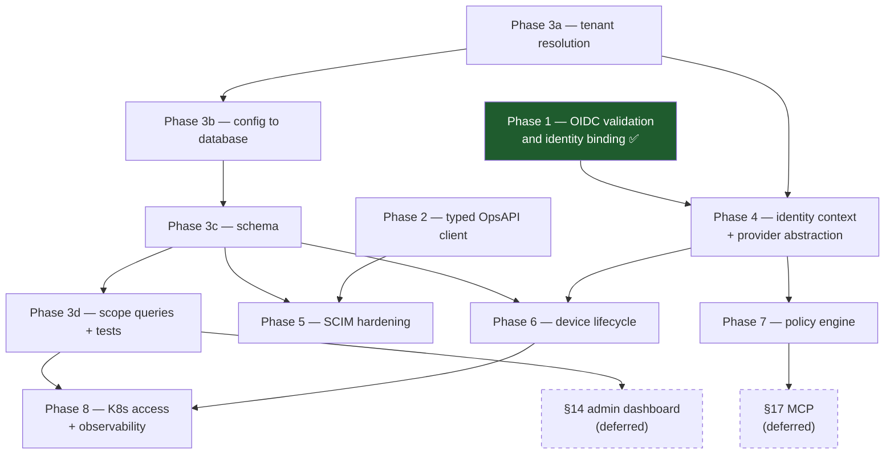

# Implementation plan — enterprise identity and access

Written after inspecting this repository and the OpsAPI instance it integrates
with. Every claim about OpsAPI here was read from its source or verified against
a running instance; where the two disagreed with expectations, the plan follows
what is actually there.

Decisions this plan rests on: [ADR-0002](decisions/0002-multi-tenancy-config-first.md)
(multi-tenancy, configuration first) and
[ADR-0003](decisions/0003-opsapi-is-a-directory-not-a-provider.md) (OpsAPI is a
directory, not an identity provider).

## What already exists

Worth stating plainly, because the target architecture in the brief describes a
greenfield workspace and this is not one. 12,500 lines of Rust across seven
crates, 263 passing tests, a Helm chart, hash-chained audit, per-route
authorization guards, GitOps policy delivery, and macOS and iOS clients.

| Area | State |
|---|---|
| Control plane | `wsl-control` — Axum, PostgreSQL, 5 migrations, per-route guards, rate limiting |
| Data plane | `wsl-gateway` — WireGuard peer reconciliation, nftables service restriction |
| Endpoint | `wsl-agent`, `wsl-cli`, `wsl-desktop`, `wsl-ios` — real tunnel bring-up, posture signals |
| Policy | `wsl-policy` — YAML documents, default deny, first-match, GitOps applied |
| Identity | OIDC relying party, SCIM 2.0 server, OpsAPI inbound provisioning, two roles |
| Audit | Append-only, hash-chained, attributed to the acting principal |

So this is extension work. The brief's suggested crate layout
(`wslvpn-identity`, `wslvpn-transport`, …) is **not** adopted: renaming seven
working crates and splitting a coherent control plane into five services would
be motion without progress. New capability goes into the existing shape —
`wsl-opsapi` as a new crate, identity work inside `wsl-control`.

## Gap analysis against the brief

Scored against what is in the repository today, not against intent.

| Brief section | State | Gap |
|---|---|---|
| §4 OpsAPI integration | Inbound only — OpsAPI calls `/api/v1/ops/*` | No outbound typed client. See Phase 2 |
| §5 Unified identity | Users, groups, two roles | No tenant. No normalised `IdentityContext`. No service accounts |
| §6 OIDC / SSO | **Done in Phase 1** | Was unverified; now discovery, JWKS, `iss`/`aud`/`exp`/`nonce`/`email_verified` |
| §7 SCIM 2.0 | Server at `/SCIM/v2` — users, groups, PATCH, activate/deactivate | No pagination or filtering. No tenant scoping. No ETag concurrency |
| §8 Directory integrations | One hardcoded OIDC provider from config | No provider abstraction, no `identity_providers` rows, no per-tenant provider |
| §9 Identity linking | **Done in Phase 1** | `(issuer, sub)` binding with takeover and deprovisioning rules |
| §10 Device identity | Registration, revocation, posture signals, keys in Keychain | No approval workflow, no key rotation, no device-to-tenant binding |
| §11 Transport | WireGuard, split/full tunnel, service restriction | No application-level proxy mode, no QUIC |
| §12 Policy engine | Default deny, first-match, versioned, GitOps, audited | No dry-run endpoint, no explain output, no conflict reporting |
| §13 Kubernetes | Helm chart, NetworkPolicy, probes, distroless | No kubeconfig generation, no K8s RBAC bridging |
| §14 Admin dashboard | None | Whole surface |
| §15 Observability | Prometheus metrics, structured logs, audit | No OpenTelemetry traces, no per-tenant metric dimensions |
| §17 MCP | None | Whole surface |
| §18 API / SDK | OpenAPI via utoipa, typed Rust client in `wsl-agent` | No versioning policy, no webhooks, no TypeScript SDK |

Two things in the brief are deliberately deferred rather than planned: the
Next.js admin dashboard (§14) and MCP integration (§17). Both are large, neither
is a dependency of anything else here, and both are better built against a
finished multi-tenant API than alongside one.

## Phases

Ordering is driven by dependency, not by the brief's numbering. The rule
throughout: **nothing is called done until it has a test that fails when it
regresses.**

### Phase 1 — OIDC validation and identity binding — ✅ complete

Done first because it was a live privilege-escalation path, and because every
later phase inherits whatever identity means here.

The callback decoded the `id_token` without verifying its signature, audience,
issuer, expiry or nonce, took the `email` claim as the identity, and upserted on
it with `active = TRUE`. Combined with `bootstrap.admin_emails`, which grants the
admin role by address, a token bearing an administrator's address made the bearer
an administrator — and a token minted for any other application at the same
provider was accepted.

Shipped:

- Discovery from `/.well-known/openid-configuration`; endpoints are no longer
  guessed from the issuer.
- Signature verification against `jwks_uri`, key selected by `kid`, with an
  asymmetric algorithm allowlist and key-family matching.
- `iss`, `aud`, `exp` (with configurable skew), `nonce` and `email_verified`
  all enforced. Rejections answer `401` with no detail; the reason is logged.
- Key rotation without restart, rate limited so random `kid`s cannot amplify
  into requests at the provider.
- `oidc_identities` binds `(issuer, sub)` to a user. Email became a mutable
  attribute. Refuses to link a second subject from one issuer to an existing
  user; never reactivates a deactivated user.
- `internal_url` for split-horizon deployments, so strict issuer checking works
  where the provider is reached at a different address than it names.

Evidence: 20 unit tests, 8 database-backed linking tests, 4 live-provider tests.
A full login was driven end to end against Dex — discovery, nonce, code
exchange, verification, binding.

### Phase 2 — typed OpsAPI client (`crates/wsl-opsapi`)

Depends on: nothing. Can run in parallel with Phase 3.

Built against the verified contract, not the shipped OpenAPI document, which
describes four of well over a hundred routes.

- Form-encoded bodies where OpsAPI expects them. A JSON body to `/auth/login` is
  silently ignored — this is the first thing a `reqwest.json()` client gets wrong.
- `Authorization: Bearer opsk_…` API keys. Namespace-bound with scopes, and the
  only credential OpsAPI has that works without interactive email-OTP 2FA.
- `X-Namespace-Id` / `X-Namespace-Slug`, which OpsAPI refuses when they disagree
  with the key's own namespace.
- Its error envelope: `{error: {code, category, context, correlation_id,
  occurrence_uuid, message, title}}`. `correlation_id` is worth carrying into our
  own logs.
- Timeouts, bounded retries on idempotent verbs only, and no secret or token
  ever logged.
- Contract tests against a live instance, marked `#[ignore]` like
  `tests/oidc_live_provider.rs`, because a generated document cannot stand in for
  the contract.

### Phase 3 — tenancy, configuration first

Depends on: nothing. The long pole. Sequenced per ADR-0002 — reordering these
sub-phases produces the "false floor" ADR-0001 named.

- **3a. Tenant resolution.** A request must establish its tenant *before*
  authentication. Until this exists nothing after it is real.
- **3b. Configuration into the database.** `identity.oidc` becomes rows in
  `identity_providers` (the table exists, unused). `gitops.path` becomes a
  per-tenant policy source. `bootstrap.admin_emails` becomes tenant-scoped grants.
  IPAM becomes per-tenant.
- **3c. Schema.** `tenant_id` across users, groups, devices, networks, routes,
  services, gateways, policies, sessions, audit, `oidc_identities`. Five
  uniqueness constraints become composite. A default tenant so existing
  deployments upgrade rather than reinstall.
- **3d. Scope the queries.** ~35 of them, plus a cross-tenant denial test per
  resource, modelled on `tests/api_authorization.rs`. The bug to hunt is a
  session whose network and gateway belong to different tenants.

Not multi-tenant until 3d is done and tested, and must not be described as such
before then.

### Phase 4 — identity context and provider abstraction

Depends on: Phase 3a (a tenant to put in the context).

`IdentityContext` carrying subject, tenant, provider, roles, groups, device and
session, resolved once per request and threaded through policy evaluation and
audit. An `IdentityProvider` trait so more than one provider can be configured
per tenant, with provisioning as a *separate* capability — OpsAPI does SCIM,
Entra does SCIM, a bare OIDC provider does not, and a single trait that assumes
otherwise forces stubs that lie.

### Phase 5 — SCIM hardening

Depends on: Phase 3c (tenant-scoped provisioning), Phase 2 (the OpsAPI direction).

Pagination, filtering, ETag concurrency, tenant-scoped credentials, replay
handling, and the rule that deprovisioning revokes sessions rather than waiting
for expiry. Malformed-payload and privilege-escalation tests.

### Phase 6 — device lifecycle

Depends on: Phase 3c (device-to-tenant), Phase 4 (posture in the context).

Approval workflow, key rotation, the `Pending → Verified → Active → Revoked`
states as real states rather than a `revoked` boolean, and the separation the
brief asks for: device identity, device authentication, posture *evidence*, and
the authorization decision as four distinct things. Platform limits on posture
documented — `docs/POSTURE.md` already does this and should keep doing it.

### Phase 7 — policy engine

Depends on: Phase 4 (richer context to evaluate).

Dry-run evaluation, explainable decisions, conflict reporting, and an approval
gate on policy application. Any AI-drafted policy passes deterministic validation
and human approval before it is applied — never applied directly.

### Phase 8 — Kubernetes access and observability

Depends on: Phase 3 (tenant dimensions), Phase 6 (device trust).

Short-lived kubeconfig generation with no long-lived cluster-admin credential,
WSLVPN policy and Kubernetes RBAC kept as separate layers, OpenTelemetry traces,
and per-tenant metric dimensions.

## Dependency map

Phase 1 is complete. Phases 2 and 3a have no prerequisites and can start
together; Phase 3 is the critical path from there.

## Component dependency map

Which parts of the system each phase touches, so the blast radius is visible
before the work starts.

| Phase | Crates | Migrations | Config | Docs |
|---|---|---|---|---|
| 1 ✅ | `wsl-control` (`auth/`) | `006` | `identity.oidc.{clock_skew_secs,internal_url}` | OIDC, SECURITY, THREAT-MODEL |
| 2 | `wsl-opsapi` (new), `wsl-control` | — | `opsapi.{base_url,api_key,namespace}` | OPSAPI |
| 3 | all of `wsl-control`, `wsl-types` | `007`–`009` | breaking: identity + gitops move to DB | ARCHITECTURE, SECURITY, THREAT-MODEL, UPGRADING, OPERATIONS |
| 4 | `wsl-control`, `wsl-types`, `wsl-policy` | — | per-tenant providers | AUTHORIZATION |
| 5 | `wsl-control` (`routes/scim.rs`) | `010` | SCIM credentials per tenant | SCIM |
| 6 | `wsl-control`, `wsl-agent`, iOS/desktop | `011` | device approval policy | CLIENT, POSTURE, IOS |
| 7 | `wsl-policy`, `wsl-control` | `012` | — | GITOPS, AUTHORIZATION |
| 8 | `wsl-control`, `wsl-gateway`, Helm | `013` | OTLP endpoint | OPERATIONS, ARCHITECTURE |

## Testing obligations

The brief says not to claim production readiness from unit tests alone, and the
existing suite already follows that — `tests/api_authorization.rs` drives the
real router against a real database. Extending it:

- **Cross-tenant denial** per resource, per phase 3d. The single most important
  new category.
- **Live contract tests** against OpsAPI and the identity provider, `#[ignore]`d,
  because generated documents drift and a running system does not.
- **Negative security tests** as the default shape: the valuable assertion is
  what is refused. Phase 1's suite is built this way — 16 of its 20 unit tests
  assert a refusal.
- **Migration upgrade tests**, extending `tests/migration_upgrade.rs`, since
  Phase 3 changes constraints on populated tables.

## Known limitations after Phase 1

Stated so they are not mistaken for finished work.

- Still single-tenant. Phase 1 changed nothing about that.
- One identity provider per deployment, from configuration. The
  `identity_providers` table remains unused until Phase 3b.
- First login still attaches to a provisioned user by verified email. That is
  deliberate and bounded by the three rules in `docs/OIDC.md`, but it is a link on
  an attribute; a provider-supplied `external_id` matched against the directory
  would be stronger, and needs Phase 2.
- `email_verified` is now required. A provider that does not send it will refuse
  every login — correct, and a configuration failure that shows up as a total
  outage rather than a warning. Called out in `docs/OIDC.md`.
- No logout or session revocation at the provider. `end_session_endpoint` is read
  from discovery and not yet used.
